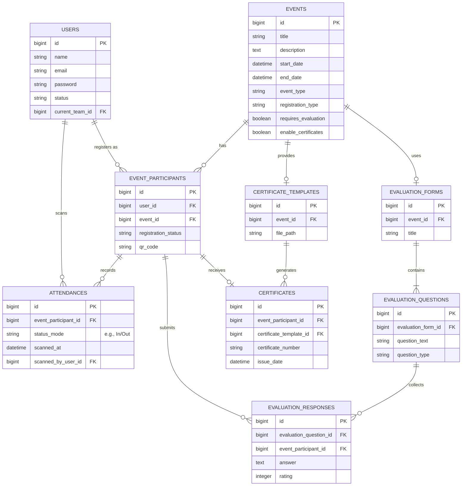

```mermaid
erDiagram
    USERS {
        bigint id PK
        string name
        string email
        string password
        string status
        bigint current_team_id FK
    }
    
    EVENTS {
        bigint id PK
        string title
        text description
        datetime start_date
        datetime end_date
        string event_type
        string registration_type
        boolean requires_evaluation
        boolean enable_certificates
    }
    
    EVENT_PARTICIPANTS {
        bigint id PK
        bigint user_id FK
        bigint event_id FK
        string registration_status
        string qr_code
    }
    
    ATTENDANCES {
        bigint id PK
        bigint event_participant_id FK
        string status_mode "e.g., In/Out"
        datetime scanned_at
        bigint scanned_by_user_id FK
    }
    
    EVALUATION_FORMS {
        bigint id PK
        bigint event_id FK
        string title
    }
    
    EVALUATION_QUESTIONS {
        bigint id PK
        bigint evaluation_form_id FK
        string question_text
        string question_type
    }
    
    EVALUATION_RESPONSES {
        bigint id PK
        bigint evaluation_question_id FK
        bigint event_participant_id FK
        text answer
        integer rating
    }
    
    CERTIFICATE_TEMPLATES {
        bigint id PK
        bigint event_id FK
        string file_path
    }
    
    CERTIFICATES {
        bigint id PK
        bigint event_participant_id FK
        bigint certificate_template_id FK
        string certificate_number
        datetime issue_date
    }

    USERS ||--o{ EVENT_PARTICIPANTS : "registers as"
    USERS ||--o{ ATTENDANCES : "scans"
    EVENTS ||--o{ EVENT_PARTICIPANTS : "has"
    EVENTS ||--o| EVALUATION_FORMS : "uses"
    EVENTS ||--o| CERTIFICATE_TEMPLATES : "provides"
    EVENT_PARTICIPANTS ||--o{ ATTENDANCES : "records"
    EVENT_PARTICIPANTS ||--o{ EVALUATION_RESPONSES : "submits"
    EVENT_PARTICIPANTS ||--o| CERTIFICATES : "receives"
    EVALUATION_FORMS ||--|{ EVALUATION_QUESTIONS : "contains"
    EVALUATION_QUESTIONS ||--o{ EVALUATION_RESPONSES : "collects"
    CERTIFICATE_TEMPLATES ||--o{ CERTIFICATES : "generates"
```
